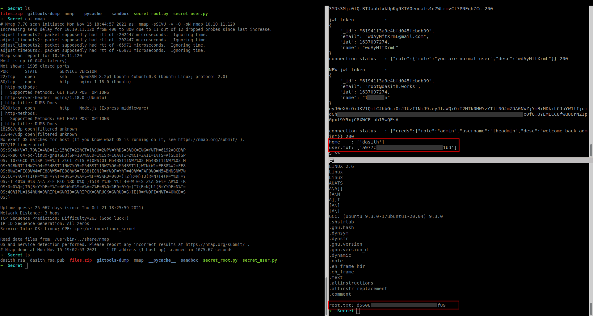

# Secret

## Access to exploits

### To access all repository content

`gpg-zip -d content.gpg`
the password is the hash inside root.txt

### To access each user's exploit individually
`gpg secret_root.gpg`
the password is the hash inside root.txt

`gpg secret_user.gpg`
the password is the hash inside user.txt

## Preview

